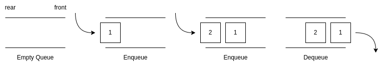

# Queue

A queue is an abstract data structure (ADT) that follows First In, First Out (FIFO) principle.

## Basic Operations

- `enqueue`: Adds an element to the rear of the queue
- `dequeue`: Removes an element from the front of the queue
- `peek`: Gets the value of the front element without removing it
- `is_empty`: Checks if the queue is empty
- `is_full`: Checks if the queue is full

## Time & Space Complexity

The complexity of enqueue and dequeue operations in a queue using an array is $O(1)$. If you use `pop(n)` on a Python list, then the complexity might be $O(n)$ depending on the position of the element to be popped.